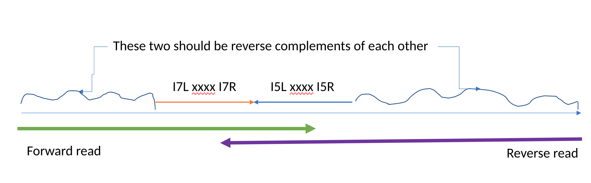

[](https://edwards.flinders.edu.au)
[](https://opensource.org/licenses/MIT)
[](https://www.zenodo.org/badge/latestdoi/643454906)


# MGI Filtering Primers

## What is it?

We found that many of the MGI reads that we are getting back from our service provider contain remnants of the I7 or I5 primers. We are not sure, yet, why that is happening. We suspect it is because our library preps are resulting in very short sequences (<200 bp) and so we are reading right through the sequence.

This really bad diagram that Rob drew sort of explains what we see:



We are barcoding our sequences, and the barcodes fall in the middle of the I7 primer in the forward read and the middle of the I5 primer in the reverse read. (The xxx's in the figure). 

Our primer sequences are:

```
`GATCGGAAGAGCACACGTCTGAACTCCAGTCACxxxxxxATCTCGTATGCCGTCTTCTGCTTG


AATGATACGGCGACCACCGAGATCTACACxxxxxxACACTCTTTCCCTACACGACGCTCTTCCGATC
```

with the x's replaced by our barcodes.

In many forward reads we see remnants of the I7 adapters, and in many reverse reads we see remnants of the I5 primers, but those sequences are reverse complemented.

We have termed the bits on either side of the barcodes `left` and `right`. (I know, not so imaginative). So we talk about the `I7 left` sequence to mean `GATCGGAAGAGCACACGTCTGAACTCCAGTCAC` and the `I7 right sequence` to mean `ATCTCGTATGCCGTCTTCTGCTTG`.

We have developed this software to quickly and efficiently filter out these adapter sequences from our reads.

## Should I use this?

If you are doing MGI sequencing using these adapters, then yes, you should check your sequences to see if you find the adapter sequences. If you do, just let us know so that we don't drive ourselves mad thinking it is just us!

## What if I have different adapters?

We provide an option for you to provide your own adapter sequences. If you want to search more, post an issue or let us know. We may have a search solution for you.

## How does it work?

We use 2-bit encoding of the DNA sequences to convert the sequences to a number:


Base | Two-bit encoding | Number
--- | --- | ---
A | 00 | 0
C | 01 | 1
G | 10 | 2
T | 11 | 3


We use a 64-bit integer and We can encode any sequence, upto 31 bases (because the encoding is 0-63 bits), using two bit encoding. By default, we start with the low bits (eg.0000000000000000000000000000000000000000000000000000000000000011 represents a single T). We have provided the vanity function `char* int_to_binary(uint64_t);` that will take any encoding and return a string representation of the binary code for that sequence.

We start by calculating the value for a 31bp sequence, using a technique called [bit-shifting](https://en.wikipedia.org/wiki/Bitwise_operation#Bit_shifts), essentially multiplying the number by 2 each time. So we start wirh our T, like about, and then add a C, so we get 0000000000000000000000000000000000000000000000000000000000001101.  Notice how the two 11's that represent the T have moved to the left by two spots, and then we added a 01 for the C.

So we calculate the numbers for all the adapter sequences and remember them. Then, we look through a file, and at every position we calculate the encoding for 31bp at a time. If that number is the same as one of the adapters, we have found the adapter, and can remove it. However, there is a cool CS trick here: we don't calculate that number for all 31 positions for every base in the sequence, We start at position 0 and calculate our number that represents from bases 0 to 30 (31 in total). Now for bases from 1 to 31 we remove the number for the base at position 0, move everything to the left two spots, and add the number for the base at position 31. Similarly, for the next string - positions 2-32 (inclusive) we remove the base at position 1 from the left of the number, move everything over, and add the number for the base at position 32. Thus, instead of doing 31 operations for each base in the sequence, we actually only do three (subtraction, bit-shifting, and addition).

The second step that we had to implement was to check for integers representing each of the variants in the adapter sequence, so we check for:


```
GATCGGAAGAGCACACGTCTGAACTCCAGTCAC
AATCGGAAGAGCACACGTCTGAACTCCAGTCAC
CATCGGAAGAGCACACGTCTGAACTCCAGTCAC
TATCGGAAGAGCACACGTCTGAACTCCAGTCAC
GCTCGGAAGAGCACACGTCTGAACTCCAGTCAC
GGTCGGAAGAGCACACGTCTGAACTCCAGTCAC
GTTCGGAAGAGCACACGTCTGAACTCCAGTCAC
...
```

To do this, we use a binary search tree. If you want more information about that, watch Rob's YouTube channel.

Now that we have found the adapters, we trim the sequences at those positions and print out the trimmed sequences. 

*Adjustments*. There is one more adjustment that we make. Refer to the figure above and it becomes apparent that the sequence on the left from the forward read and the sequence on the right from the reverse read that are complimentary to each other should be the same length. We compare those sequences and use this logic:

- If we find one adapter but not the other, we assume there is an additional error, so we trim both reads to the same point. This is a bit of a belt and braces option.
- If we find adapters in both reads, but at different positions, we trim to the shorter sequence. We haven't (yet) figured out why this happens, but it is only a really small subset of reads. We're working on that!

# How good is MGI sequencing anyway?

It turns out, that this _artefact_ has let us look at the accuracy of MGI sequencing, since we are re-sequencing the same, known, sequence over and over again. 


In one of our sequence files there are 4,080,961 matches to the original I7 left sequence and 289,173 matches that are off by one base. Since this is a 31 bp sequence (\*), that means we were correct (31 \* 4,080,961) + (30 \* 289,173) and incorrect 289,173 times = 289,173/135,184,981 = 0.0021 = 0.2% error rate.

In the corresponding R2 file for the same sequence, there are 3,739,251 matches to the original I5right sequence and 516,133 matches that are off by one base. Since this is a 31 bp sequence (\*), that means we were correct (31 \* 3,739,251) + (30 \* 516,133) and incorrect 516,133 times = 516,331/131,400,771 = 0.0039 = 0.4% error rate.

In this particular run we used 127 different barcodes, and from the whole run we found 280,761,713 I7 left matches and 21,987,467 I7 left mismatches: 0.235% error rate in the forward reads, and we found 242,271,909 I5 right matches and 41,321,566 I5 right mismatches: 0.472% error.

It seems that the MGI sequencer is twice as accurate in the forward direction as the reverse direction. (And, no, your assembly algorithm probably doesn't care about that!).


## I'm sold, how do I use it?

The code is written in ANSI-C, and should be portable to any machine you use. The only dependency is on the inimitable [kseq](https://lh3lh3.users.sourceforge.net/kseq.shtml) library, and we include a copy of that for you (in `include/`, obvs). However, do post an issue if you have trouble with make or make install.

You can install the executables from source, you just need GCC. Clone this git repo and use make:

```bash
git clone https://github.com/linsalrob/mgi-adapters.git
cd mgi-adapters
make all
make install PREFIX=$HOME/bin
```

This will install `search-mgi-adapters` and `filter_reads_with_n` into `$HOME/bin`. You can also `sudo make install` to install it into `/usr/local/bin` if you really want, but I wouldn't do that.

## How do I run the code

If you have one pair of fastq files, you can specify those on the command line:

```
search-mgi-adapters -l R1.fsatq.gz -r R2.fastq.gz
```

If you want to specify diffent output files you can do so:

```
search-mgi-adapters -l R1.fsatq.gz -r R2.fastq.gz -p R1.trimmed.fastq.gz -q R2.trimmed.fastq.gz
```

(Note: At the moment we _only_ write the sequences gzip compressed)

You can specify different adapter sequences with `-s` and `-f`. Note that we search for the _reverse complement_ of the `-f` sequence because its the one in the reverse (R2) reads.

We also provide three additional files, a list of all the hits to the I7 left sequence in R1 reads, a list of all the hits to the I5 right sequences in the R2 reads, and then a list of all the adjustments made (see _adjustments_ above). There are command line options to redirect those to files, or you can use `/dev/null` to not get the output.

## Wow! How do I cite this amazing piece of work

Check our out DOI code and please cite it as:

```
Edwards, J.A. and Edwards, R.A. MGI-Adapter Trimming: Efficient Removal of Sequencing Adapters. DOI: 10.5281/zenodo.7954281
```


# Contributors

Most of the code was written by Rob Edwards with some help from John Edwards.
